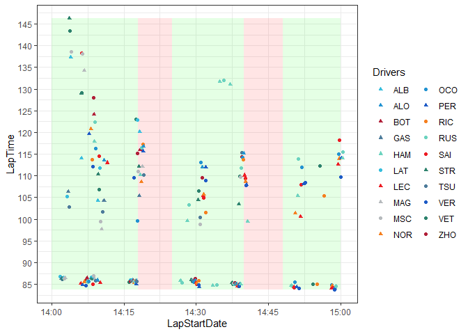
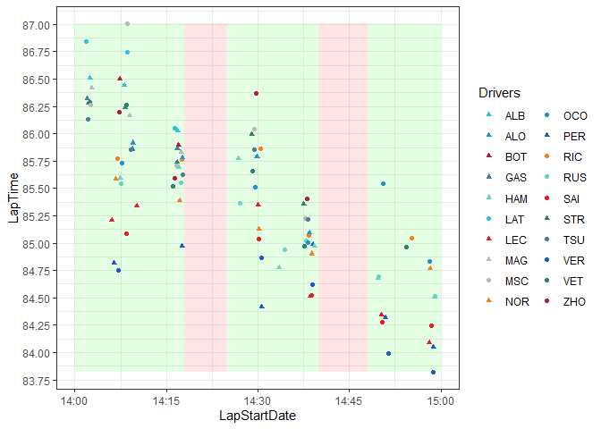
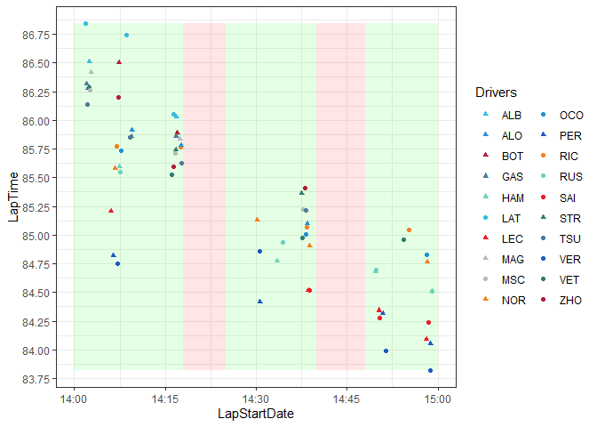
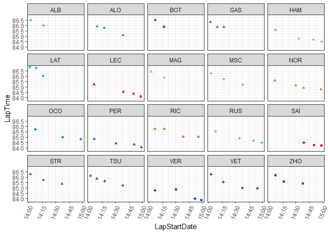
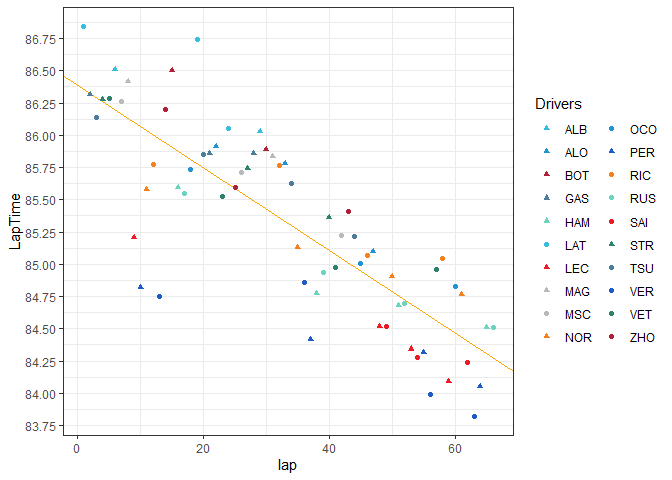
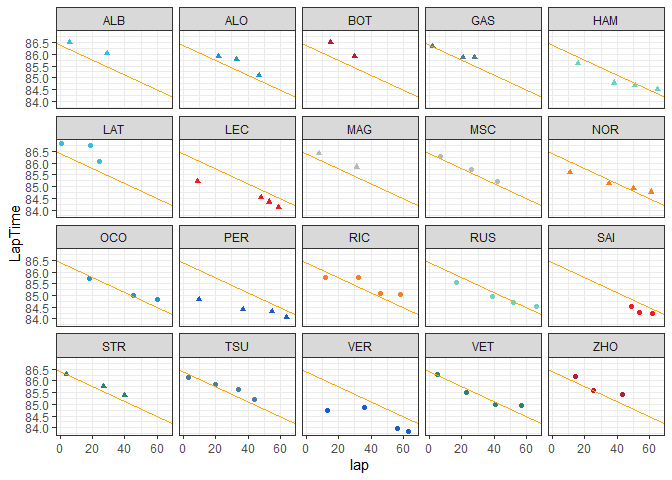
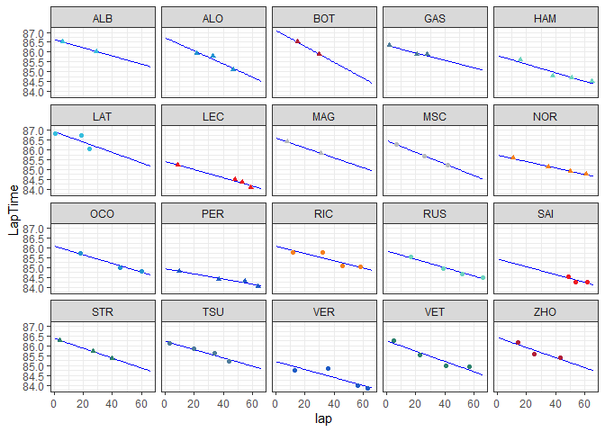
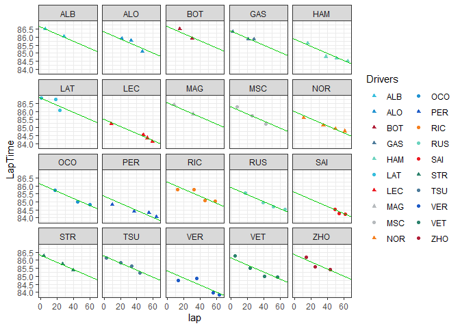

Multilevel Modeling of Formula 1 Track Evolution
================

## Introduction

In car racing, the track surface can change significantly over the
course of an event leading to variation in lap times. Lap time variation
can exist for many reasons, but “track evolution” is known to cause a
decrease in lap times due to additional rubber laying down on the track,
increasing grip.

To quantify track evolution at a recent Formula 1 qualifying event, a
Bayesian hierarchical model is used and the inferences are compared to
simple linear regression models. The 2022 Abu Dhabi Grand Prix
qualifying session is analyzed using the FastF1 API and rstanarm
Bayesian models.

## Data: FastF1

The data for this analysis was sourced from the FastF1 API
(https://theoehrly.github.io/Fast-F1/). This API provides access to F1
lap times, car telemetry, session results, and more. It is a Python
module designed for use with Pandas, NumPy, and Matplotlib. However, the
following analysis will make use of R packages, so the data are
downloaded and stored as CSV files.

## The 2022 Abu Dhabi Grand Prix

In the 2022 Formula 1 season, the last event of the year was the 2022
Abu Dhabi Grand Prix. During qualifying, many commentators observed
there was a great amount of track evolution. By accessing all lap times
during this qualifying session, we can quantify the degree of track
evolution during this event.

``` python
import fastf1

# works faster if there is a cache folder
fastf1.Cache.enable_cache('../data/cache')

# load the 2022 Abu Dhabi Grand Prix qualifying dataset
qual = fastf1.get_session(2022, 'Abu Dhabi Grand Prix', 'Q')
qual.load()

# get the team colors for plotting and save as CSV
colors = qual.results[['TeamColor', 'TeamName']]
colors.to_csv('../data/team_colors.csv')

# get laptimes and convert to seconds
qlaps = qual.laps
qlaps['LapTime'] = qlaps['LapTime'].dt.total_seconds()

# save as CSV
qlaps.to_csv('../data/laps.csv')
```

## Lap Times

We can look at the laptimes for all drivers during all three qualifying
sessions.



Here the green sections represent active qualifying sessions (Q1, Q2,
and Q3) and red sections represent breaks between the sessions (for more
details on the F1 qualifying format can be found at
https://en.wikipedia.org/wiki/Formula_One#Qualifying).

There is a clear distinction between fast times and very slow times. The
group of fast times are “flying laps” and the slower times are “out
laps”, where drivers come from the pitlane prior to starting a flying
lap, and “in laps”, where the drivers finish a flying lap and continue
on prior to entering the pitlane.

Only flying laps are considered for this analysis, so times above 90
seconds are removed.



Here we can see a clear trend of times decreasing over the course of the
session. This is due to many factors, not only track evolution. Some
drivers with faster cars may not push as hard and take more risks until
the later stages of the session. Also, some teams will not use brand new
tires if they don’t need to. Tire age has a large impact on lap times.
For the purpose of simplifying this analysis, only laps where drivers
are using brand new tires will be considered.



This dataset contains all drivers’ hotlaps on brand new tires. The
linear trend is still apparent. Visualizing this for each driver we
have:



Assuming this shared trend is due to track evolution only, and not
driver risk management, fuel loads, etc., we can try to quantify this
effect.

## Simple Linear Regression

A naive approach to quantifying track evolution could be a simple linear
regression model with lap number as a covariate. As the number of laps
driven on track increases, more rubber is laid down, causing the track
to “grip up” and reduce lap times. Ambient weather also has an effect
and changes over time as lap numbers increase, but for simplicity
“flying lap number i”, $l_i$ is used as the covariate.

A Bayesian implementation of this simple linear regression model is

$$
\begin{aligned}
T_{i} \sim N(\mu_{i}, \sigma^2) \\
\mu_{i} = \alpha + \beta_l l_{i}
\end{aligned}
$$

That is, laptime $T$ for observed lap $i$ is normally distributed with
mean $\mu_i$ and variance $\sigma^2$. $\mu_i$ is linearly related to a
global intercept $\alpha$ and a global slope parameter $\beta_l$.

Priors are non-informative and normally distributed:

$$
\begin{aligned}
\alpha \sim N(90, 20) \\
\beta_l \sim N(0, 1) \\
\sigma^2 \sim Exp(1)
\end{aligned}
$$

This model can be fit using rstanarm’s “stan_glm” function.

``` r
slr <- stan_glm(
  # model
  LapTime ~ lap, 
  
  # priors
  prior_intercept = normal(90, 20, autoscale = TRUE),
  prior = normal(0, 1, autoscale = TRUE), 
  prior_aux = exponential(1, autoscale = TRUE),
  
  # setup
  family = gaussian, 
  data = flying_laps, 
  chains = 4, iter = 10000, seed = 1, 
)
```

The results are shown in the table and visualization below.

``` r
tidy(slr)
```

    # A tibble: 2 × 3
      term        estimate std.error
      <chr>          <dbl>     <dbl>
    1 (Intercept)  86.4      0.108  
    2 lap          -0.0318   0.00280



From this model, we obtain a lap coefficient of -0.032. That is, each
additional hotlap on the circuit is expected to reduce a driver’s lap
time by about 30 thousandths of a second.

Practically, if a team chose to send their two drivers on track first,
record a pair of lap times, and then wait for the other 18 cars to
record their lap times, that first team could expect their next runs to
be almost 0.6 seconds faster by the assumptions of this model and the
data.

However, this model ignores the grouped structure of the data and
assumes each laptime observation is independent of the others. Because
each driver tends to produce similar laptimes, laptimes are correlated
within each driver.

This model also does not predict well for each driver. It does not
capture between driver variation, for example, the differences between
Latifi’s (LAT) and Verstappen’s (VER) laptimes.



Another modeling approach could be to fit a linear model for each
driver:



This works, but the estimates are extremely unreliable especially for
drivers with very few total laps. Additionally this doesn’t provide an
overall estimate of track evolution, only one specific to each driver.

## Multilevel Model

To estimate track evolution, we can use a multilevel model, specifically
a varying-intercepts model. The goal is to estimate a global “slope”
parameter, one that is fixed across all drivers, capturing the track
evolution effect while simultaneously capturing variability between
drivers. That is, a model with varying intercepts but fixed slopes
across all drivers.

$$
\begin{aligned}
T_{ij} \sim N(\mu_{ij}, \sigma_T^2) \\
\mu_{ij} = \alpha_j + \beta_l l_{ij}
\end{aligned}
$$

This model appears similar to the simple linear regression above but
instead now relies on each driver, $j$, and contains more parameters,
one intercept term, $\alpha_j$, for each driver $j$.

The priors are different too. Instead of assigning a global intercept
prior $\alpha$, we assign 20 intercept priors, $\alpha_j$, each relying
on a global shared prior which pools information among all drivers,
$\alpha_g$. Each variance term also gets its own non-informative prior.
$\sigma_T$ represents the variance in laptimes within each driver, $j$,
and $\sigma_{\alpha}$, the variance in laptimes between drivers.

$$
\begin{aligned}
\alpha_j \sim N(\alpha_g, \sigma_{\alpha}) \ \text{for j = 1, 2, ..., 20}\\
\alpha_g \sim N(90, 20) \\
\beta_l \sim N(0, 1) \\
\sigma_T \sim Exp(1) \\
\sigma_{\alpha} \sim Exp(1)
\end{aligned}
$$

Fitting this model in rstanarm using the “stan_glmer” function,

``` r
mlm <- stan_glmer(
  # model
  LapTime ~ lap + (1 | Driver), 
  
  # priors
  prior_intercept = normal(90, 20),
  prior = normal(0, 1),
  prior_aux = exponential(1, autoscale = TRUE),
  prior_covariance = decov(reg = 1, conc = 1, shape = 1, scale = 1),
  
  # setup
  family = gaussian,
  data = flying_laps,
  chains = 4, iter = 10000, seed = 1
)
```

Examining the fixed effect for laptime, we see that there is a 0.010
second difference compared to the simple linear regression model. That
is, track evolution may not be as high as one would expect using the
simple linear regression model. The estimate for track evolution is a
decrease of 0.022 seconds per flying lap.

``` r
tidy(mlm, effects = 'fixed')
```

    # A tibble: 2 × 3
      term        estimate std.error
      <chr>          <dbl>     <dbl>
    1 (Intercept)  86.1      0.107  
    2 lap          -0.0221   0.00136

Practically, the scenario where a team sends their drivers, waits for
all other drivers to complete flying laps, and then send their drivers
again results in a track evolution difference of 0.4 seconds.
Previously, the simple linear regression model predicted a difference of
0.6 seconds. This 0.2 second difference from earlier is a result of
using a more correct model and is a large difference in the context of
Formula 1 laptimes.

Combining this global slope term with each driver’s estimated intercept
term, we have



This model appears to generalize better to the data, providing a
reliable estimate of track evolution for that day.

Although this model is fairly simple, it could be extended in many ways.
For example, each team produces cars that are similar to each other.
This could be used as another grouping variable within a model.
Additional covariates could be included such as tire life, tire
compounds, weather, fuel loads, etc. Another idea is to extend this
analysis across tracks and inform which tracks typically experience high
degrees of track evolution. This information could be used to inform
teams to optimze race and qualifying strategy decisions.
